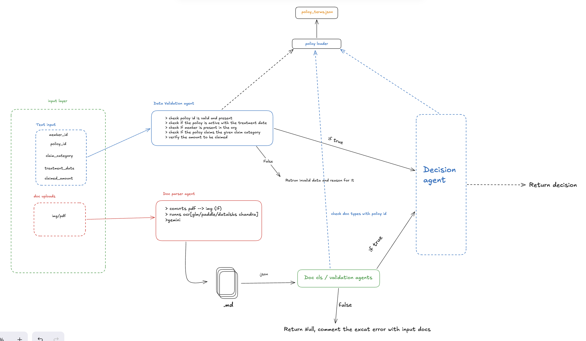

# Multi-Agent Health Insurance Claims Pipeline

## Overview

A LangGraph-based pipeline that processes health insurance claims through four sequential agents. Each agent reads from and writes to a shared `ClaimState` object. The pipeline produces a final `DecisionOutput` with a decision, approved amount, and full audit trace.

---

## Pipeline Flow



The pipeline is a **distributed graph**, not a linear chain. Two independent input streams — structured claim fields and raw document uploads — are processed in parallel branches that converge at the Decision Agent.

- **Structured input path:** `DataValidatorAgent` validates the claim fields against the policy. If validation fails, the pipeline halts immediately and returns an error. If it passes, state is forwarded toward the Decision Agent.
- **Document path:** `DocParserAgent` converts each uploaded file into a structured `ExtractedDocument` dict. `DocValidatorAgent` then checks document types, readability, and patient name consistency against the policy. If validation fails, the pipeline halts. If it passes, extracted data flows to the Decision Agent.
- **Decision Agent:** receives the validated structured state and the extracted document data and applies all policy rules to produce a final decision.

Any node can set `halted=True` to short-circuit the remaining pipeline. Unhandled exceptions in any node are caught by the `_safe` wrapper — confidence is penalised by 0.20 and the claim is flagged for manual review rather than crashing.

---

## Confidence Scoring

Overall claim confidence is a deterministic pipeline-health score, not a learned probability. Every claim starts at `1.0` at pipeline entry, and each agent may carry that value forward unchanged or reduce it by a fixed penalty when validation fails, parsing degrades, or a component errors.

### How it works

1. `run_pipeline()` initialises `state["confidence"] = 1.0`
2. Each agent reads the current confidence from `ClaimState`
3. If an agent encounters a known degraded condition, it subtracts a fixed penalty and writes the updated scalar back to state
4. `DecisionMakerAgent` does not recalculate confidence from policy logic; it returns the accumulated score unchanged
5. `DecisionOutput.confidence_score` is the final rounded value from `state["confidence"]`

### Penalty schedule

| Source | Trigger | Penalty |
|---|---|---|
| `_safe` graph wrapper | Unhandled exception in any node | `-0.20` |
| `DataValidatorAgent` | Structured-input validation halt | `-0.20` |
| `DataValidatorAgent` | Simulated component failure path | `-0.20` |
| `DocParserAgent` | Per unreadable document | `-0.15` |
| `DocParserAgent` | Per parse error or missing content / file bytes | `-0.10` |
| `DocValidatorAgent` | Document-validation halt | `-0.15` |
| `DocValidatorAgent` | Simulated component failure path | `-0.15` |

### Important distinction: claim confidence vs document confidence

The pipeline also stores a per-document extraction confidence inside each `ExtractedDocument`. In production OCR mode, Gemini is prompted to return `0.95` when key fields are present and reduce that figure for missing fields. If extraction notes are present, the parser caps document confidence at `0.60`.

That document-level score is used for traceability and debugging only. It does not currently feed back into the overall claim confidence score. Only the fixed pipeline penalties above affect `DecisionOutput.confidence_score`.

---

## Setup

### API Key

The pipeline calls Gemini (Google AI Studio) for document OCR and policy-rule reasoning. You need a `GOOGLE_API_KEY` before running anything.

1. Get a key at [aistudio.google.com](https://aistudio.google.com/app/apikey)
2. Copy the example env file and fill it in:

```bash
cp .env.example .env
# open .env and replace the placeholder with your key
```

`.env` is gitignored — never commit your key.

---

### Option A — uv (recommended)

[uv](https://github.com/astral-sh/uv) is a fast Python package manager. Install it once if you don't have it:

```bash
curl -LsSf https://astral.sh/uv/install.sh | sh
```

Then install all dependencies and run the app:

```bash
uv sync
uv run streamlit run src/frontend/app.py
```

`uv sync` reads `pyproject.toml`, creates a `.venv`, and installs everything in one step. `uv run` executes the command inside that environment without needing to activate it manually.

---

### Option B — miniconda / pip (optional)

If you prefer Conda:

```bash
conda create -n claims-pipeline python=3.11
conda activate claims-pipeline
pip install -r requirements.txt
pip install -e .
streamlit run src/frontend/app.py
```

`pip install -e .` installs the `src/` package in editable mode so imports resolve correctly.

---

## Shared State (`ClaimState`)

All agents communicate through a single `TypedDict`. Fields annotated with `operator.add` are **append-only** — each node's list is appended to the existing one. All other fields are overwritten by whichever node last wrote them.

```python
class ClaimState(TypedDict):
    # Set at pipeline entry
    claim_id:                str
    claim_input:             dict               # ClaimInput.model_dump()

    # Written by DataValidatorAgent
    member:                  Optional[dict]
    policy:                  Optional[dict]

    # Written by DocParserAgent
    extracted_docs:          list[dict]         # list of ExtractedDocument dicts

    # Pipeline control (any node can set these)
    halted:                  bool
    halt_message:            Optional[str]

    # Written by DecisionMakerAgent
    decision:                Optional[str]      # APPROVED | PARTIAL | REJECTED | MANUAL_REVIEW
    approved_amount:         Optional[float]
    breakdown:               Optional[dict]
    line_item_decisions:     list[dict]
    reason:                  str

    # Append-only — accumulated across all nodes
    trace:                   Annotated[list[dict], operator.add]
    component_failures:      Annotated[list[str], operator.add]
    rejection_reasons:       Annotated[list[str], operator.add]
    manual_review_signals:   Annotated[list[str], operator.add]

    # Scalars overwritten per node
    confidence:              float
    manual_review_recommended: bool
```

---

## Pipeline Entry: `ClaimInput`

The pipeline is started via `run_pipeline(claim: ClaimInput)`. The `ClaimInput` is serialised to a dict and stored in `state["claim_input"]`.

```python
class ClaimInput(BaseModel):
    member_id:                  str
    policy_id:                  str
    claim_category:             str          # CONSULTATION | DIAGNOSTIC | PHARMACY
                                             # DENTAL | VISION | ALTERNATIVE_MEDICINE
    treatment_date:             str          # YYYY-MM-DD
    claimed_amount:             float
    documents:                  list[Document]
    hospital_name:              Optional[str]
    ytd_claims_amount:          float        # default 0.0
    claims_history:             list[ClaimsHistory]
    simulate_component_failure: bool         # default False

class Document(BaseModel):
    file_id:              str
    file_name:            Optional[str]
    actual_type:          str   # PRESCRIPTION | HOSPITAL_BILL | LAB_REPORT
                                # PHARMACY_BILL | DENTAL_REPORT | DISCHARGE_SUMMARY
    quality:              str   # GOOD | UNREADABLE | LOW
    patient_name_on_doc:  Optional[str]
    content:              Optional[DocumentContent]  # pre-supplied in test/demo mode
    file_data:            Optional[bytes]            # raw bytes in production mode
    media_type:           Optional[str]

class DocumentContent(BaseModel):
    patient_name:         Optional[str]
    doctor_name:          Optional[str]
    doctor_registration:  Optional[str]
    hospital_name:        Optional[str]
    diagnosis:            Optional[str]
    treatment:            Optional[str]
    date:                 Optional[str]
    medicines:            Optional[list[str]]
    tests_ordered:        Optional[list[str]]
    line_items:           Optional[list[LineItem]]  # {description: str, amount: float}
    total:                Optional[float]
    test_name:            Optional[str]

class ClaimsHistory(BaseModel):
    claim_id:   str
    date:       str
    amount:     float
    provider:   Optional[str]
```

---

## Agent 1: `DataValidatorAgent`

**Source:** `src/agents/data_validator.py`

### Input (reads from `ClaimState`)

| Field | Type | Source |
|---|---|---|
| `state["claim_input"]` | `dict` | pipeline entry |
| `state["confidence"]` | `float` | pipeline entry (1.0) |

### What it does

Validates all structured claim fields before any document processing. Halts immediately on the first failure with a specific, actionable message.

Checks run in order:
1. `policy_id` matches the loaded policy
2. `member_id` exists in the member roster
3. `treatment_date` falls within the policy's active period (`policy_start_date` ≤ date ≤ `policy_end_date`)
4. `claim_category` is one of the six valid values
5. `claimed_amount` is at or above the policy minimum (default ₹500)

No LLM is used. All checks are deterministic Python against the loaded policy JSON.

### Output (writes to `ClaimState`)

```python
# On success
{
    "member":                    dict,   # member record from policy roster
    "policy":                    dict,   # full raw policy dict
    "halted":                    False,
    "halt_message":              None,
    "confidence":                float,
    "trace":                     list[dict],
    "component_failures":        [],
    "manual_review_recommended": False,
}

# On any check failure
{
    "member":                    None,
    "policy":                    dict,
    "halted":                    True,
    "halt_message":              str,    # specific reason, e.g. "Member ID 'M999' is not registered..."
    "confidence":                float,  # penalised by 0.20
    "trace":                     list[dict],
    "component_failures":        [],
    "manual_review_recommended": False,
}
```

Each entry in `trace` follows this shape throughout the entire pipeline:

```python
{
    "agent":  str,   # e.g. "DataValidatorAgent"
    "step":   str,   # e.g. "member_lookup"
    "result": str,   # PASS | FAIL | WARNING | ERROR | INFO
    "detail": str,   # human-readable message
}
```

---

## Agent 2: `DocParserAgent`

**Source:** `src/agents/doc_parser.py`

### Input (reads from `ClaimState`)

| Field | Type | Source |
|---|---|---|
| `state["claim_input"]["documents"]` | `list[dict]` | pipeline entry |
| `state["confidence"]` | `float` | from DataValidatorAgent |

### What it does

Extracts structured fields from each uploaded document. Operates in two modes:

- **Test / demo mode** — `document.content` is already populated → fields are read directly, no LLM call.
- **Production mode** — `document.file_data` is present → Gemini Vision OCR is called (see LLM section below).

Documents marked `UNREADABLE` are recorded in the trace, confidence is penalised by 0.15, and a stub entry is added so downstream agents know the document exists but could not be read.

When running Gemini Vision OCR, the model also returns a per-document extraction confidence. That value is preserved inside each `ExtractedDocument`, but it does not directly change the overall claim confidence. The overall claim confidence only changes through the fixed penalties described above.

### LLM usage — Gemini Vision OCR (production mode only)

**Model:** `gemini-3.1-flash-lite` (via `google.generativeai`)  
**Trigger:** only when `document.file_data` is present (real file upload)  
**What it does:** converts the document image to a structured JSON with all medical fields in a single API call — no separate regex parsing

Pre-processing before the LLM call:
1. If the file is a PDF, the first page is rasterised to PNG at 150 DPI
2. The image is letterboxed into a 640×640 square (single Vision tile, fewer tokens)
3. The base64-encoded PNG is sent to Gemini with `response_mime_type=application/json`

The prompt instructs the model to return exactly this JSON structure:

```json
{
  "file_id": "doc_001",
  "doc_type": "HOSPITAL_BILL",
  "patient_name": "Rohan Mehta",
  "doctor_name": "Dr. Priya Sharma",
  "doctor_registration": "KA/45678/2015",
  "hospital_name": "Apollo Hospitals",
  "diagnosis": "Acute Bronchitis",
  "treatment": "Nebulisation + antibiotics",
  "date": "2024-11-01",
  "medicines": [],
  "tests_ordered": [],
  "line_items": [
    {"description": "Consultation fee", "amount": 800},
    {"description": "Nebulisation", "amount": 1200}
  ],
  "total_amount": 2000,
  "quality": "GOOD",
  "confidence": 0.95,
  "extraction_notes": []
}
```

### Output (writes to `ClaimState`)

```python
{
    "extracted_docs":     list[dict],  # one ExtractedDocument dict per input document
    "confidence":         float,
    "trace":              list[dict],
    "component_failures": list[str],
}
```

Each `ExtractedDocument` dict:

```python
{
    "file_id":            str,
    "doc_type":           str,          # HOSPITAL_BILL | PRESCRIPTION | LAB_REPORT | ...
    "patient_name":       Optional[str],
    "doctor_name":        Optional[str],
    "doctor_registration":Optional[str],
    "hospital_name":      Optional[str],
    "diagnosis":          Optional[str],
    "treatment":          Optional[str],
    "date":               Optional[str],
    "medicines":          list[str],
    "tests_ordered":      list[str],
    "line_items":         list[dict],   # [{"description": str, "amount": float}]
    "total_amount":       Optional[float],
    "quality":            str,          # GOOD | UNREADABLE | LOW | ERROR | UNKNOWN
    "confidence":         float,        # 0.0–1.0
    "extraction_notes":   list[str],
}
```

---

## Agent 3: `DocValidatorAgent`

**Source:** `src/agents/doc_validator.py`

### Input (reads from `ClaimState`)

| Field | Type | Source |
|---|---|---|
| `state["claim_input"]["documents"]` | `list[dict]` | pipeline entry |
| `state["claim_input"]["claim_category"]` | `str` | pipeline entry |
| `state["extracted_docs"]` | `list[dict]` | from DocParserAgent |
| `state["confidence"]` | `float` | from DocParserAgent |

### What it does

Validates the parsed documents against policy rules before any decision logic runs. Halts on the first failure.

Checks run in order:
1. **Readability** — any document with `quality=UNREADABLE` triggers an immediate halt naming the specific file(s) and asking the member to re-upload
2. **Required document types** — the policy defines which document types are mandatory per claim category; missing types are named explicitly in the halt message
3. **Patient name consistency** — all documents that carry a patient name must reference the same person (case-insensitive, whitespace-normalised)

No LLM is used. All checks are deterministic.

### Output (writes to `ClaimState`)

```python
# On success
{
    "halted":                    False,
    "halt_message":              None,
    "confidence":                float,
    "trace":                     list[dict],
    "component_failures":        [],
    "manual_review_recommended": False,
}

# On any check failure
{
    "halted":                    True,
    "halt_message":              str,    # e.g. "Missing required document(s) for a DENTAL claim: DENTAL_REPORT."
    "confidence":                float,  # penalised by 0.15
    "trace":                     list[dict],
    "component_failures":        [],
    "manual_review_recommended": False,
}
```

---

## Agent 4: `DecisionMakerAgent`

**Source:** `src/agents/decision_maker.py`

### Input (reads from `ClaimState`)

| Field | Type | Source |
|---|---|---|
| `state["claim_input"]` | `dict` | pipeline entry |
| `state["extracted_docs"]` | `list[dict]` | from DocParserAgent |
| `state["member"]` | `dict` | from DataValidatorAgent |
| `state["confidence"]` | `float` | accumulated |
| `state["manual_review_recommended"]` | `bool` | accumulated |

### What it does

Applies all policy rules in a fixed, deterministic sequence and produces one of four outcomes: `APPROVED`, `PARTIAL`, `REJECTED`, or `MANUAL_REVIEW`.

This agent does not compute a new confidence score from approval or rejection logic. It reads the accumulated `state["confidence"]` and returns it unchanged in the final result. A clean rejection for a policy reason can therefore still have `confidence=1.0`, while an approval after degraded processing may have a lower score.

Checks run in order:

| # | Check | Method | Early exit on failure |
|---|---|---|---|
| 1 | Same-day claim count ≥ limit | Deterministic — counts `claims_history` | → `MANUAL_REVIEW` |
| 2 | Monthly claim count ≥ limit | Deterministic — counts `claims_history` | → `MANUAL_REVIEW` |
| 3 | `claimed_amount` > auto-review threshold | Deterministic comparison | → `MANUAL_REVIEW` |
| 4 | Exclusion check | **LLM** — semantic matching | → `REJECTED` |
| 5 | Initial waiting period (join date + N days) | Deterministic date arithmetic | → `REJECTED` |
| 6 | Condition-specific waiting period | **LLM** maps diagnosis → condition key, then date arithmetic | → `REJECTED` |
| 7 | Pre-authorisation required | Deterministic — high-value test + amount threshold | → `REJECTED` |
| 8 | Per-claim limit | Deterministic comparison | → `REJECTED` |
| 9 | Dental line-item approval | Deterministic string match against covered/excluded procedure lists | → `PARTIAL` or `REJECTED` |
| 10 | Amount calculation | Deterministic — network discount → co-pay → sub-limit | produces `approved_amount` |

### LLM usage — two calls, structured output only

Both calls use `gemini-3.1-flash-lite` via `langchain_google_genai.ChatGoogleGenerativeAI` with `with_structured_output(PydanticModel)`. The LLM returns typed objects — no free-text parsing.

**Call 1 — Exclusion semantic matching**

Triggered when `diagnosis` or `treatment` is present in `extracted_docs`.

- **Input to LLM:** claim category, diagnosis, treatment, list of policy exclusion strings
- **LLM task:** decide whether the diagnosis/treatment falls under any exclusion, respecting the claim category (e.g. `ALTERNATIVE_MEDICINE` claims are not rejected for "experimental treatments")
- **Structured output schema:**
  ```python
  class ExclusionCheckResult(BaseModel):
      is_excluded:       bool
      matched_exclusion: Optional[str]  # which exclusion string matched, or None
      reasoning:         str
  ```
- **On `is_excluded=True`** → claim is `REJECTED`, `matched_exclusion` is included in the rejection message
- **On LLM failure after one retry** → claim is routed to `MANUAL_REVIEW` with a message stating the AI service is unavailable

**Call 2 — Waiting period condition mapping**

Triggered when condition-specific waiting periods exist in the policy and `diagnosis` or `treatment` is present.

- **Input to LLM:** diagnosis, treatment, list of condition key strings from the policy's `specific_conditions` dict
- **LLM task:** map the free-text diagnosis to the closest condition key, or return `null` if no match
- **Structured output schema:**
  ```python
  class WaitingPeriodMatch(BaseModel):
      matched_condition: Optional[str]  # key from specific_conditions, or None
      reasoning:         str
  ```
- **On a match** → deterministic date arithmetic checks if `days_since_join < condition_waiting_days`; if so, claim is `REJECTED`
- **On LLM failure after one retry** → claim is routed to `MANUAL_REVIEW`

**Retry policy (both calls):** each call is attempted once, then retried once on any exception. Rate-limit errors (`429`, `quota`, `resource exhausted`) trigger a 4-second back-off before the retry; all other errors use 2 seconds. If the second attempt also fails, the claim is halted and routed to `MANUAL_REVIEW` — the pipeline never crashes on LLM unavailability.

### Output (writes to `ClaimState`)

```python
{
    "decision":                  str,          # APPROVED | PARTIAL | REJECTED | MANUAL_REVIEW
    "approved_amount":           Optional[float],
    "rejection_reasons":         list[str],    # e.g. ["EXCLUDED_CONDITION"], ["WAITING_PERIOD"]
    "manual_review_signals":     list[str],    # e.g. ["same-day claim limit exceeded"]
    "trace":                     list[dict],
    "confidence":                float,
    "manual_review_recommended": bool,
    "reason":                    str,          # human-readable summary for the member
    "breakdown":                 Optional[dict],
    "line_item_decisions":       list[dict],
}
```

`breakdown` schema (when present):

```python
{
    "claimed_amount":            float,
    "network_discount_percent":  Optional[float],
    "network_discount_amount":   Optional[float],
    "amount_after_discount":     Optional[float],
    "copay_percent":             Optional[float],
    "copay_amount":              Optional[float],
    "sub_limit_applied":         Optional[float],
    "approved_amount":           float,
}
```

Each entry in `line_item_decisions` (DENTAL claims only):

```python
{
    "description": str,
    "amount":      float,
    "approved":    bool,
    "reason":      Optional[str],  # set when approved=False
}
```

---

## Pipeline Output: `DecisionOutput`

`run_pipeline()` converts the final `ClaimState` into a typed Pydantic model:

```python
class DecisionOutput(BaseModel):
    claim_id:                  str
    decision:                  Optional[Decision]   # APPROVED | PARTIAL | REJECTED | MANUAL_REVIEW | None (halted)
    approved_amount:           Optional[float]
    reason:                    str
    rejection_reasons:         list[str]
    confidence_score:          float
    trace:                     list[TraceEntry]
    component_failures:        list[str]
    manual_review_signals:     list[str]
    line_item_decisions:       list[LineItemDecision]
    breakdown:                 Optional[AmountBreakdown]
    manual_review_recommended: bool
    halt_message:              Optional[str]        # set only when pipeline was halted early
```

---

## LLM Summary

| Agent | Call | Model | When triggered | Structured output |
|---|---|---|---|---|
| `DocParserAgent` | Vision OCR | `gemini-3.1-flash-lite` | Production mode — `file_data` present | Raw JSON parsed to `ExtractedDocument` dict |
| `DecisionMakerAgent` | Exclusion check | `gemini-3.1-flash-lite` | `diagnosis` or `treatment` extracted | `ExclusionCheckResult` (Pydantic) |
| `DecisionMakerAgent` | Waiting period mapping | `gemini-3.1-flash-lite` | Condition-specific waiting periods exist | `WaitingPeriodMatch` (Pydantic) |

All numeric calculations, threshold comparisons, and date arithmetic are deterministic Python. The LLM is used only where free-text semantic understanding is required — identifying whether a diagnosis is excluded, and mapping a free-text diagnosis to a policy condition key. Every LLM failure degrades gracefully to `MANUAL_REVIEW`.
